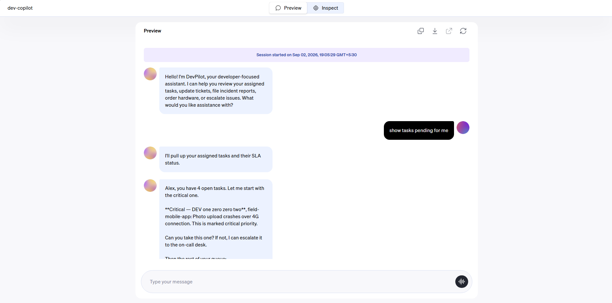

# DevPilot

    Author:        Aromal TR
    Wave:          wave-01-mantle
    Assessed on:   2026-09-15
    Assessed by:   Aromal TR
    Verified with: rasa-pro 3.20.0.dev6, Python 3.11+, uv

DevPilot is a hands-free **voice assistant for developers**. It listens when you
talk, figures out what you want, and does the work — pulling up your task queue,
updating tickets, writing an on-call handoff, gating a deploy, or setting a
reminder. All of it is spoken, so you never have to type.

It is built with **Rasa Skills** (the Mantle engine) and uses
**Deepgram** for both speech-to-text and text-to-speech, with **DeepSeek**
(`deepseek-chat`) driving the routing and conversation.

> **Demo developer:** Alex Chen (id `101`, badge `4021`). The project ships
> with a seeded SQLite world — tasks, tickets, PRs, deployments, reminders —
> so you can try every feature without wiring up a real backend.



---

## What DevPilot can do

Talk to it like you'd talk to a teammate:

| Skill | What it does |
| --- | --- |
| `dispatch` | Lists today's open tasks with priority and SLA status |
| `ticket_notes` | Lists/updates/reopens tickets, adds notes, files incident reports from a spoken rant, runs a standup or daily briefing |
| `find_job` | Picks a single task by reference or project name |
| `job_status` | Checks SLA / urgency for a task |
| `job_close` | Closes a finished task, collecting diagnosis, resolution, and hours in order |
| `parts_order` | Orders hardware and licenses, with manager approval for restricted items |
| `authenticate` | Verifies the developer with their 4-digit badge code |
| `escalation` | Pages the on-call engineer |
| `deploy_gate` | Deploys to staging or production, blocked while critical tickets are open on that project |
| `pr_tracker` | Shows PRs waiting on you plus your own PRs' CI status |
| `reminders` | Sets and lists personal reminders |
| `handoff` | Builds an end-of-shift summary for the next on-call engineer |
| `safety_faq` | Answers common development-procedure questions |
| `license_check` | Checks license seats (GitHub Copilot, JetBrains, Figma, Sentry) via MCP |
| `slack_post` | Posts/reads/replies in Slack with confirmation gates |
| `engineering_briefing` | Full cross-skill status across tickets, PRs, CI, deploys, and approvals |
| `incident_triage` | Triages an incoming incident from spoken notes |
| `incident_mode` | Puts the agent into focused incident-handling mode |
| `release_notes` | Drafts release notes from recent work |
| `preferences` | Saves personal settings (timezone, response style, Slack channel) |
| `feedback` | Logs feedback and bug reports about the assistant itself |
| `docs_lookup` | Searches the web for current documentation via Exa MCP |
| `help` | Full capability list and examples |
| `intro` / `goodbye` | Opens and closes the conversation |

### Things you can say

```
What am I working on today?
Give me a briefing
Do my standup
Mark TKT1003 done
The auth service keeps returning 500 and it's driving me insane
I need a mechanical keyboard
Deploy auth-service to staging
Any PRs waiting on me?
Remind me to check the prod logs in 30 minutes
Give me a handoff for the next engineer
How many sentry seats are left?
Post my update to slack
What do the latest Rasa docs say about slot extraction?
Draft release notes for this sprint
Set my timezone to US Pacific
```

---

## Quick start

First-time setup:

```bash
uv sync --prerelease=allow
Copy-Item .env.example .env   # then fill in the keys below
uv run python scripts/verify_setup.py
```

You need three secrets in `.env`:

| Variable | Purpose |
| --- | --- |
| `RASA_LICENSE` | Rasa Pro license |
| `OPENAI_API_KEY` | LLM for routing and conversation (DeepSeek-compatible endpoint) |
| `DEEPGRAM_API_KEY` | Speech-to-text and text-to-speech |

Train the model, then run:

```bash
uv run python -m rasa train
uv run python -m rasa run --enable-api --port 5005 --inspect
```

Open the Inspector at
`http://localhost:5005/webhooks/inspector/inspect.html`
and start talking. If you'd rather drive it from code, run a second server in
REST mode on another port:

```bash
uv run python -m rasa run --enable-api --port 5006
```

> **Windows note:** the `rasa.exe` shim is broken (`Failed to canonicalize
> script path`). Always use `uv run python -m rasa ...`, never `uv run rasa ...`.
> Use `--inspect` on the first Rasa process to serve the Inspector UI.

---

## Slack

DevPilot can work in Slack two ways — both read/write your Slack app's tokens
from `.env` (`SLACK_BOT_TOKEN`, `SLACK_APP_TOKEN`).

### 1. Posting — the MCP bridge

A small MCP server exposes Slack as a tool (`post_message`, `list_channels`),
so any skill can post to a channel. This is what the `slack_post` skill uses.

```bash
uv run python scripts/mcp_slack_serve.py    # Slack MCP bridge on :8001
```

The `slack` entry in `integrations.yml` points at
`http://127.0.0.1:8001/mcp`, so the model's native MCP runtime talks to Slack
at inference time. Try it: `post my update to slack`.

### 2. Talking two-way — the Socket Mode listener

A small Socket Mode listener bridges Slack ↔ Rasa, so everyone in the channel
can talk to DevPilot from Slack and get the reply back in a thread.

```bash
uv run python scripts/mcp_slack_serve.py    # MCP bridge first (Rasa needs it)
uv run python -m rasa run --enable-api --port 5006
uv run python scripts/slack_listener.py     # then the listener
```

Mention `@DevPilot` in the channel the listener is watching (default
`all-devcopilot`) and it forwards your message to the Rasa REST server, then
posts the answer in reply. The Slack app needs **Socket Mode** on and the
`app_mention` + `message.channels` events subscribed — no public URL or ngrok
required.

> Rasa fails to start if an MCP server it depends on is down, so bring up both
> MCP bridges (`licenses` on :8000, `slack` on :8001) before Rasa.

---

## Web search — Exa MCP

DevPilot can search the web for up-to-date documentation using the
[Exa](https://exa.ai) hosted MCP server (keyless, no API key required).
When a developer asks a question not covered by the internal FAQ, the
`safety_faq` skill hands off to `docs_lookup`, which calls `web_search_exa`
and `web_fetch_exa` to find and cite current docs.

```yaml
# integrations.yml (excerpt)
mcp_servers:
  - name: exa
    url: https://mcp.exa.ai/mcp
    tool_timeout: 8
```

Try it: `what do the latest Rasa docs say about slot extraction?`

---

## Evaluation harness

The project includes a simulation/evaluation harness for automated scenario
testing against a live Rasa server.

```bash
# run all scenarios (uses eval/conftest.yml for LLM config)
uv run python scripts/run_eval.py

# run a single scenario
uv run python scripts/run_eval.py --scenario eval/scenarios/dispatch_queue.yml
```

Scenarios live in `eval/scenarios/` and results are written to
`eval/results/<timestamp>/`. The harness drives the agent through multi-turn
conversations and scores the responses using LLM-as-judge (with a DeepSeek
`deepseek-chat` fallback for structured-output modes).

### Scenarios

| Scenario | What it tests |
| --- | --- |
| `dispatch_queue` | Lists today's tasks with priority and SLA |
| `license_check_seats` | Checks license seat availability |
| `slack_post_deploy` | Posts a deployment update to Slack |

---

## How it works (the short version)

Rasa Skills flips the old Rasa model on its head. In classic Rasa you wrote
`domain.yml`, stories, and rules, and the bot matched intents to pre-written
flows. Mantle drops all of that. Now each ability is a **skill** — a plain
markdown file of instructions that an LLM reads and follows. The LLM *is* the
dialogue engine: it decides which skill matches, gathers the info it needs, and
calls the right tools.

```text
  Developer (voice or text)
        │
        ▼
  Rasa Inspector  ── Deepgram ASR (speech → text), Deepgram TTS (text → speech)
        │
        ▼
  Rasa Mantle   ← LLM picks a skill, follows its instructions
        │
   ┌────┴──────────┐
   ▼               ▼
 Skills          Tools
 (skill.md)      (@tool functions)  →  SQLite demo database
```

The pipeline is: you speak → Deepgram turns it into text → Rasa picks a skill →
the LLM reads that skill's instructions → for anything that touches data it
calls a `@tool` Python function → the LLM turns the result into a short spoken
reply → Deepgram speaks it back.

### The three building blocks

- **Skills** (`skills/<name>/skill.md`) — the instructions. A skill starts with
  a `description` (this is what Rasa uses to match a message to the skill) and
  a `name`, then the body is plain-English steps for the LLM to follow.

- **Tools** (`@tool` functions) — the actual work. Reading the database,
  writing a ticket, creating a reminder. Most live inside their skill's
  `tools.py`. Only helpers used by two or more skills live in the shared
  `tools/operations.py` (`load_developer_profile`, `list_jobs`).

- **Memory** (`memory.yml`) — shared state across turns, so the bot remembers
  which ticket it's looking at, what mode it's in, and whether the developer is
  verified. Skills read it via fully-namespaced keys like
  `session.ticket_notes.mode`.

### Progressive control

Not everything needs the same amount of guard-railing, so Mantle lets you dial
control up where a mistake is costly and leave things loose where it isn't:

| Control | What it does | Where |
| --- | --- | --- |
| `tool_constraints.requires` | Hides a tool until a memory condition is true | Skill frontmatter |
| `tool_constraints.requires_confirmation` | Forces an "shall I go ahead?" before a state-changing tool | Skill frontmatter |
| `if:` paragraphs | Includes instructions only when a condition matches | Skill body |
| `:::ordered_block` | Collects several pieces of info in a fixed order | Skill body |
| `@skill.<name>` | Hands off to another skill mid-conversation | Skill body |
| `requires:` (root) | Gates the whole skill — e.g. deploys and orders need auth first | Skill frontmatter |

Two skills are the best showcases of layered control:

- **`ticket_notes`** branches into modes (`list / update / reopen / comment /
  standup / briefing / file`), confirmation-gates every write, and uses an
  ordered block to collect an incident report field by field.
- **`deploy_gate`** is auth-gated at the skill level, checks for blocking
  critical tickets before the deploy tool can even be called, and re-checks at
  record time.

---

## Project layout

```
agent.yml            Identity, persona, voice flags, and global rules
integrations.yml     DeepSeek LLM + Inspector channel with Deepgram ASR/TTS + MCP servers
endpoints.yml        Response rephraser and optional platform services
memory.yml           Project-wide session memory
responses.yml        Project-wide verbatim responses (greeting, fallback)
skills/<name>/       One folder per skill: skill.md, optional tools.py, memory.yml, responses.yml
tools/operations.py  Shared tools only (used by 2+ skills)
lib/database.py      SQLite demo backend (schema + seeding)
lib/tool_helpers.py  Helpers shared by tool functions
data/source/         JSON seed data for Alex's world
models/              Trained model archives (built by rasa train)
scripts/             verify_setup.py, validate_project.py, show_demo_data.py
scripts/mcp_*.py     Local MCP servers (licenses :8000, Slack :8001)
scripts/slack_listener.py  Socket Mode bridge: @DevPilot mentions ↔ Rasa REST
scripts/run_eval.py  Eval harness driver (DeepSeek prompt-only fallback)
eval/conftest.yml    Eval LLM config (simulator + judge both use DeepSeek)
eval/scenarios/      YAML scenario definitions for automated testing
eval/results/        Timestamped run reports (gitignored)
```

Pin: `rasa-pro==3.20.0.dev6`. LLM: DeepSeek `deepseek-chat` via the
OpenAI-compatible endpoint `https://api.deepseek.com`. This is a **Skills /
Mantle** project.

---

## The one thing that surprises people: train-time snapshots

This is the quirk that bites every first-time contributor.

Tools execute from a **snapshot** of the code made at training time
(`mantle_snapshot/`) that lives *inside the model archive* — they do **not**
run from your live project tree. Practical consequences:

- Edit any Python under `tools/`, `lib/`, or `skills/*/tools.py` → you must
  **retrain** (`uv run python -m rasa train`) before the change takes effect.
  Restarting the server alone does nothing.
- The snapshot's working directory is a temp folder, so early on the database
  was resolving to a phantom empty `operations.db` in `%TEMP%`. That's fixed in
  `lib/database.py` with `_resolve_project_root()`, which walks up from the
  snapshot until it finds `agent.yml`.

So the loop is always: **edit → validate → retrain → restart → test.**

---

## Commands

### Setup / train / validate

```bash
uv sync --prerelease=allow                 # install deps
uv run python scripts/verify_setup.py      # pre-flight checks
uv run python scripts/validate_project.py  # schema/validity check
uv run python -m rasa train                # build the model (bakes in code)
```

### Run

```bash
uv run python -m rasa run --enable-api --port 5005 --inspect   # Inspector UI on :5005
uv run python -m rasa run --enable-api --port 5006             # REST API, for code
```

### Run the eval harness

```bash
uv run python scripts/run_eval.py                            # all scenarios
uv run python scripts/run_eval.py --scenario eval/scenarios/dispatch_queue.yml
```

### Kill the servers

```powershell
Get-NetTCPConnection -LocalPort 5005 -ErrorAction SilentlyContinue |
  ForEach-Object { Stop-Process -Id $_.OwningProcess -Force }
Get-NetTCPConnection -LocalPort 5006 -ErrorAction SilentlyContinue |
  ForEach-Object { Stop-Process -Id $_.OwningProcess -Force }
```

### Reset the demo database

```powershell
Remove-Item data\operations.db -Force
uv run python -c "from lib.database import Database; Database()"
```

### Clean stale snapshots

```powershell
Remove-Item $env:TEMP\tmp*\mantle_snapshot -Recurse -Force
```

---

## Testing

There are three ways to exercise the agent:

1. **Inspector UI** (`http://localhost:5005/webhooks/inspector/inspect.html`) —
   talk or type like a human, watch the skills activate.
2. **Scripted REST tests** — a script drives `/webhooks/rest/webhook`
   turn-by-turn, exactly what the UI does but automated. It runs a dozen
   scenarios (greeting, dispatch, tickets, standup, PRs, reminders, handoff,
   incident filing, deploy gating, hardware ordering) and handles the
   confirmation/ordered-block loops the way a person would.
3. **Eval harness** (`scripts/run_eval.py`) — full simulation/evaluation with
   LLM-as-judge scoring, automated assertions, and timestamped result reports.

A quick manual check after any change: `hello`, then `what tasks do I have?`,
then `do my standup`, then `give me a handoff`.

---

## Known rough edges

- **Cold first turn doesn't fire skills** — the bot stays in `default_session_start__main` and only routes reliably after a greeting; the real usage pattern is warm sessions.
- **MCP servers must be up before Rasa starts** — Rasa immediately tries to connect every `mcp_servers` entry at startup and crashes with `"Failed to prepare runtime integrations"` if any is unreachable. A retry/backoff or lazy connect would make the stack more forgiving.
- **Train-time snapshots** — tools run from a snapshot baked into `mantle_snapshot/` inside the model archive; every skills/tools tweak demands a full `rasa train` plus server restart. A hot-reload option or faster incremental rebuild would save a lot of cycles.
- **Single-intent assumption** — a message like "task done, post to slack" occasionally routes to the wrong skill because the engine treats each message as one skill invocation. Multi-intent chaining isn't natively supported yet.
- **Eval harness scores one-shot turns only** — the harness exercises individual scenarios but doesn't score multi-turn sessions, which is where the real developer experience lives. A session-level eval pass would surface regression more reliably.
- Slack audio/huddles are **not** supported (Slack's API doesn't allow apps to join huddle audio).

---

See [`AGENTS.md`](AGENTS.md) for the developer-agent contract, layout, and
build loop.
